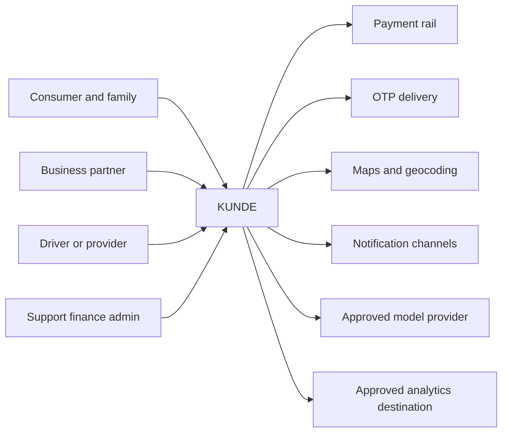

# System Context

```mermaid
flowchart LR
 C[Consumer and family] --> K[KUNDE]
 M[Business partner] --> K
 P[Driver or provider] --> K
 O[Support finance admin] --> K
 K --> PAY[Payment rail]
 K --> OTP[OTP delivery]
 K --> MAP[Maps and geocoding]
 K --> MSG[Notification channels]
 K --> AI[Approved model provider]
 K --> DATA[Approved analytics destination]
```
