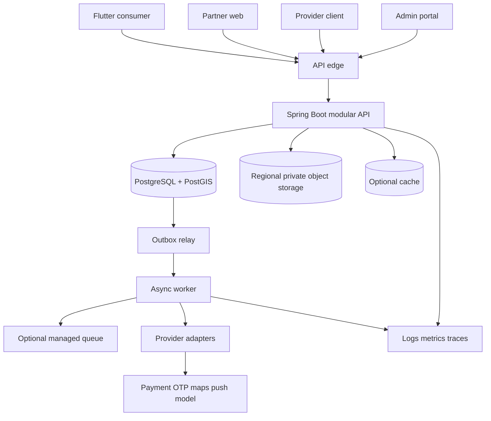

# Container Architecture

```mermaid
flowchart TB
 CON[Flutter consumer] --> EDGE[API edge]
 PART[Partner web] --> EDGE
 PROV[Provider client] --> EDGE
 ADMIN[Admin portal] --> EDGE
 EDGE --> API[Spring Boot modular API]
 API --> DB[(PostgreSQL + PostGIS)]
 API --> OBJ[(Regional private object storage)]
 API --> CACHE[(Optional cache)]
 DB --> OUT[Outbox relay]
 OUT --> WORK[Async worker]
 WORK --> QUEUE[Optional managed queue]
 WORK --> ADAPT[Provider adapters]
 ADAPT --> EXT[Payment OTP maps push model]
 API --> TEL[Logs metrics traces]
 WORK --> TEL
```
