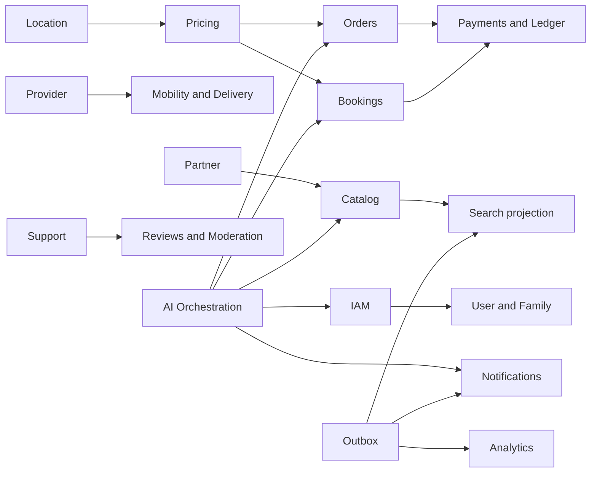

# Backend Domain Architecture

```mermaid
flowchart LR
 IAM[IAM] --> USER[User and Family]
 PARTNER[Partner] --> CAT[Catalog]
 PROVIDER[Provider] --> DISPATCH[Mobility and Delivery]
 GEO[Location] --> PRICE[Pricing]
 CAT --> SEARCH[Search projection]
 PRICE --> ORD[Orders]
 PRICE --> BOOK[Bookings]
 ORD --> FIN[Payments and Ledger]
 BOOK --> FIN
 SUPPORT[Support] --> TRUST[Reviews and Moderation]
 AI[AI Orchestration] --> IAM
 AI --> CAT
 AI --> ORD
 AI --> BOOK
 AI --> MSG[Notifications]
 OUT[Outbox] --> MSG
 OUT --> SEARCH
 OUT --> DATA[Analytics]
```
