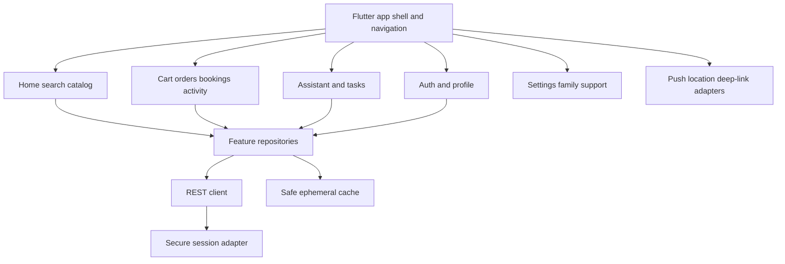

# Consumer App Architecture

```mermaid
flowchart TB
 SHELL[Flutter app shell and navigation] --> AUTH[Auth and profile]
 SHELL --> DISC[Home search catalog]
 SHELL --> TX[Cart orders bookings activity]
 SHELL --> AI[Assistant and tasks]
 SHELL --> PREF[Settings family support]
 DISC --> REPO[Feature repositories]
 TX --> REPO
 AI --> REPO
 AUTH --> REPO
 REPO --> API[REST client]
 REPO --> LOCAL[Safe ephemeral cache]
 API --> SESS[Secure session adapter]
 SHELL --> NAT[Push location deep-link adapters]
```
