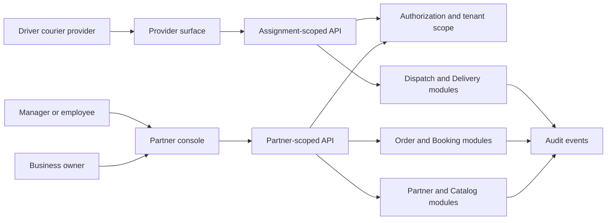

# Partner and Provider Architecture

```mermaid
flowchart LR
 OWNER[Business owner] --> PAPP[Partner console]
 MANAGER[Manager or employee] --> PAPP
 PAPP --> PAPI[Partner-scoped API]
 DRIVER[Driver courier provider] --> DAPP[Provider surface]
 DAPP --> DAPI[Assignment-scoped API]
 PAPI --> IAM[Authorization and tenant scope]
 DAPI --> IAM
 PAPI --> PARTNER[Partner and Catalog modules]
 PAPI --> ORDER[Order and Booking modules]
 DAPI --> DISPATCH[Dispatch and Delivery modules]
 PARTNER --> AUDIT[Audit events]
 ORDER --> AUDIT
 DISPATCH --> AUDIT
```
