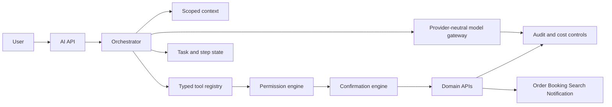

# AI Architecture

```mermaid
flowchart LR
 USER[User] --> API[AI API]
 API --> ORCH[Orchestrator]
 ORCH --> CONTEXT[Scoped context]
 ORCH --> MODEL[Provider-neutral model gateway]
 ORCH --> TOOLS[Typed tool registry]
 TOOLS --> PERM[Permission engine]
 PERM --> CONF[Confirmation engine]
 CONF --> DOMAIN[Domain APIs]
 DOMAIN --> TX[Order Booking Search Notification]
 ORCH --> TASK[Task and step state]
 MODEL --> AUDIT[Audit and cost controls]
 DOMAIN --> AUDIT
```
