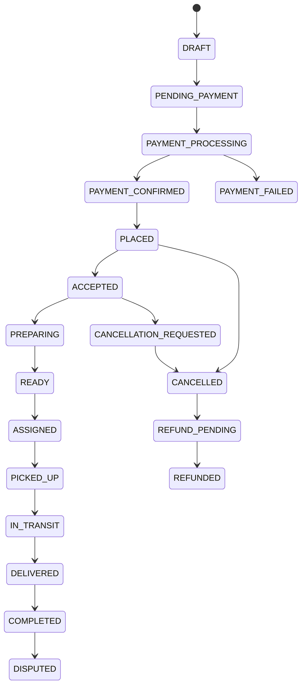

# Order Lifecycle

```mermaid
stateDiagram-v2
 [*] --> DRAFT
 DRAFT --> PENDING_PAYMENT
 PENDING_PAYMENT --> PAYMENT_PROCESSING
 PAYMENT_PROCESSING --> PAYMENT_CONFIRMED
 PAYMENT_PROCESSING --> PAYMENT_FAILED
 PAYMENT_CONFIRMED --> PLACED
 PLACED --> ACCEPTED
 PLACED --> CANCELLED
 ACCEPTED --> PREPARING
 PREPARING --> READY
 READY --> ASSIGNED
 ASSIGNED --> PICKED_UP
 PICKED_UP --> IN_TRANSIT
 IN_TRANSIT --> DELIVERED
 DELIVERED --> COMPLETED
 ACCEPTED --> CANCELLATION_REQUESTED
 CANCELLATION_REQUESTED --> CANCELLED
 CANCELLED --> REFUND_PENDING
 REFUND_PENDING --> REFUNDED
 COMPLETED --> DISPUTED
```
