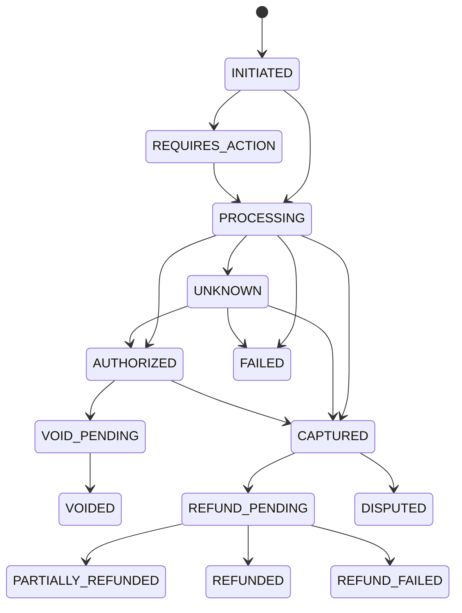

# Payment Lifecycle

```mermaid
stateDiagram-v2
 [*] --> INITIATED
 INITIATED --> PROCESSING
 INITIATED --> REQUIRES_ACTION
 REQUIRES_ACTION --> PROCESSING
 PROCESSING --> AUTHORIZED
 PROCESSING --> CAPTURED
 PROCESSING --> FAILED
 PROCESSING --> UNKNOWN
 UNKNOWN --> AUTHORIZED
 UNKNOWN --> CAPTURED
 UNKNOWN --> FAILED
 AUTHORIZED --> CAPTURED
 AUTHORIZED --> VOID_PENDING
 VOID_PENDING --> VOIDED
 CAPTURED --> REFUND_PENDING
 REFUND_PENDING --> PARTIALLY_REFUNDED
 REFUND_PENDING --> REFUNDED
 REFUND_PENDING --> REFUND_FAILED
 CAPTURED --> DISPUTED
```
