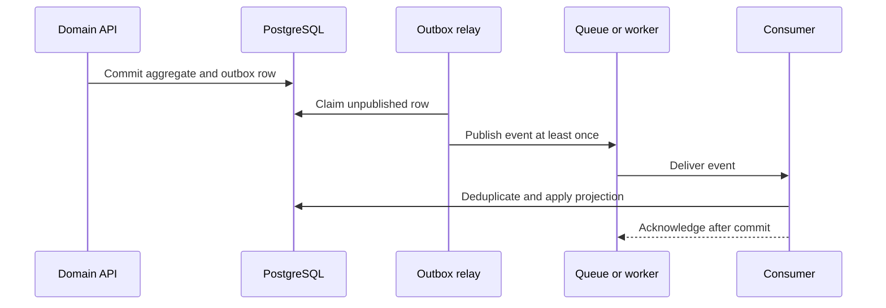

# Event Flow

```mermaid
sequenceDiagram
 participant API as Domain API
 participant DB as PostgreSQL
 participant OB as Outbox relay
 participant Q as Queue or worker
 participant C as Consumer
 API->>DB: Commit aggregate and outbox row
 OB->>DB: Claim unpublished row
 OB->>Q: Publish event at least once
 Q->>C: Deliver event
 C->>DB: Deduplicate and apply projection
 C-->>Q: Acknowledge after commit
```
