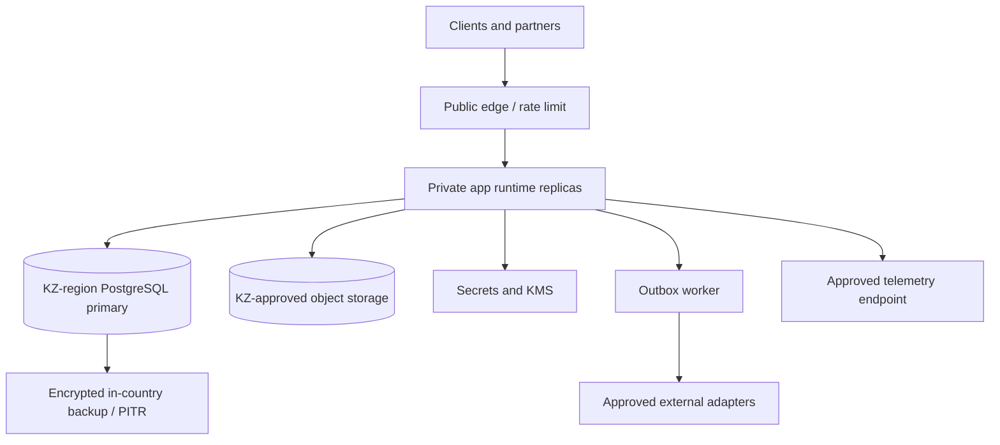

# Deployment Architecture

```mermaid
flowchart TB
 INTERNET[Clients and partners] --> WAF[Public edge / rate limit]
 WAF --> APP[Private app runtime replicas]
 APP --> DB[(KZ-region PostgreSQL primary)]
 APP --> STORE[(KZ-approved object storage)]
 APP --> SECRET[Secrets and KMS]
 APP --> OUT[Outbox worker]
 OUT --> EXT[Approved external adapters]
 APP --> TEL[Approved telemetry endpoint]
 DB --> BACKUP[Encrypted in-country backup / PITR]
```
