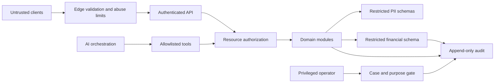

# Security Boundaries

```mermaid
flowchart LR
 CLIENT[Untrusted clients] --> EDGE[Edge validation and abuse limits]
 EDGE --> API[Authenticated API]
 API --> AUTHZ[Resource authorization]
 AUTHZ --> DOMAIN[Domain modules]
 DOMAIN --> PII[Restricted PII schemas]
 DOMAIN --> FIN[Restricted financial schema]
 AI[AI orchestration] --> TOOL[Allowlisted tools]
 TOOL --> AUTHZ
 OPS[Privileged operator] --> CASE[Case and purpose gate]
 CASE --> AUDIT[Append-only audit]
 DOMAIN --> AUDIT
 FIN --> AUDIT
```
