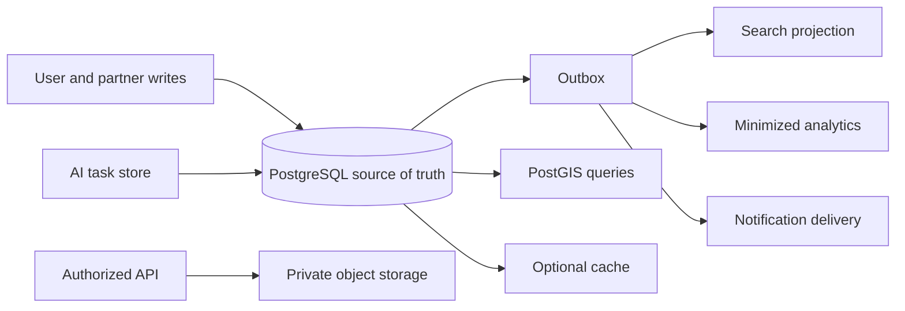

# Data Architecture

```mermaid
flowchart LR
 USER[User and partner writes] --> PG[(PostgreSQL source of truth)]
 PG --> OUT[Outbox]
 OUT --> SEARCH[Search projection]
 OUT --> ANALYTICS[Minimized analytics]
 OUT --> NOTIFY[Notification delivery]
 PG --> GEO[PostGIS queries]
 PG --> CACHE[Optional cache]
 API[Authorized API] --> OBJECT[Private object storage]
 AI[AI task store] --> PG
```
