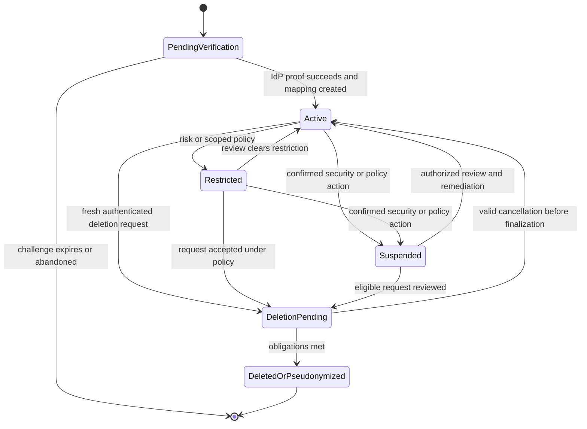

# Account lifecycle state model

```mermaid
stateDiagram-v2
  [*] --> PendingVerification
  PendingVerification --> Active: IdP proof succeeds and mapping created
  PendingVerification --> [*]: challenge expires or abandoned
  Active --> Restricted: risk or scoped policy
  Restricted --> Active: review clears restriction
  Active --> Suspended: confirmed security or policy action
  Restricted --> Suspended: confirmed security or policy action
  Suspended --> Active: authorized review and remediation
  Active --> DeletionPending: fresh authenticated deletion request
  Restricted --> DeletionPending: request accepted under policy
  Suspended --> DeletionPending: eligible request reviewed
  DeletionPending --> Active: valid cancellation before finalization
  DeletionPending --> DeletedOrPseudonymized: obligations met
  DeletedOrPseudonymized --> [*]
```

IdP sessions/credentials and KUNDE account status are separate state machines. A pending external revocation must not reactivate a suspended KUNDE account.
